Penetration Test Report - Group 5

Prepared for The Masked DJ

Testers:

[Abhijeet
Marikal](https://umd.instructure.com/groups/525869/users/4480089)

**Executive Summary**

The Masked DJ (\"Client\") engaged with ENPM634 - Group 5 (\"Testers\")
to perform a penetration test. Penetration testing is a point-in-time
exercise to determine how an attacker would attempt to compromise the
confidentiality, integrity, and availability of the Client\'s computer
systems.

**[Objective:]{.underline}**

This penetration test aims to test the IT environment security
configurations that are in place to protect the Client\'s true identity.
The goals of the penetration test included:

  ------------------------------------------------------------- ----------
  Reveal the true identity of Client                            Achieved

  Exfiltrate the six (6) flags from the systems                 Achieved
  ------------------------------------------------------------- ----------

**[Assessment Scope:]{.underline}**

The scope for the penetration test contains the following systems:

-   Final-Ubuntu

-   Final-VM1

-   Final-Windows-7

-   Final-Windows-Server-2016

**[Result Summary:]{.underline}**

Upon an in-depth evaluation, testers were able to access the true
identity of the Client. Testers also successfully exfiltrated all the
flags from the systems. During the penetration test, Testers identified
the following vulnerabilities and weaknesses in Client\'s IT
infrastructure:

-   **Devices and Operating systems that are end-of-support
    (EOS)/end-of-life (EOL)**: The testers discovered that the Client
    used Windows 7 (EOS 01/14/2020) and Ubuntu 16.04 LTS (EOL 04/2021).
    As the operating systems are EOS/EOL, the machines with those
    operating systems will not receive any security updates/patches from
    the vendors. The testers were able to exploit CVE-2017-0144 on the
    Windows 7 system. Even though Microsoft released the patch for the
    vulnerability, the system was still vulnerable because Windows 7 is
    EOS.

-   **File Permission Misconfiguration:** The testers found that the
    Client allowed any user to access sensitive data such as Active
    Directory backups, password policy, passwords, and important system
    administrative notes. The testers were able to exploit the
    misconfiguration to access sensitive data which aided the attack
    against the Client's computer systems.

-   **Insecure Storage of Password:** The testers found that the Client
    used password manager software (Keepass). However, the master
    password of the password database was stored insecurely in a text
    file available for everyone to access. The testers were able to use
    the master password to access the Keepass database file and further
    compromise the Client's systems.

-   **Weak Password Policy:** The testers discovered that the Client
    just switched from a strong password policy to a weaker one. The
    weak password policy made it possible for the testers to crack
    multiple password hashes and gain more access to the Client's
    systems. The testers also found that some passwords were from the
    published data breach. This weakness affected both the domain users
    and domain administrators.

**[Recommendations:]{.underline}**

Based on the vulnerabilities and weaknesses discovered during the
penetration test, the Testers recommend that the Client ensures his IT
manager makes the following modifications to the IT infrastructure:

-   Upgrade all the operating systems to the latest versions supported
    by the vendors. For systems that cannot be updated due to
    proprietary software or hardware, testers recommend that the client
    implement proper security controls to limit access to those systems.

-   Review all the file permissions and limit them to the need-to-know
    basis. The need-to-know principle is to limit the access to files or
    systems to only personnels that need the access, rather than open up
    the access to the whole organization.

-   Securely store password using password manager software. The testers
    also recommend securing the master password of the password database
    file.

-   Implement a strong password policy. The testers also recommend not
    allowing users to both re-use passwords and use any passwords from
    published data breaches.

-   Regularly perform security assessments such as system configuration
    reviews, vulnerability scans and penetration tests. As new
    vulnerabilities are published on a daily basis, regular security
    assessment ensures that the Client's information security personnels
    stay updated with the current threat landscape.

**Attack Narratives**

The testers started by running a ping sweep against the whole subnet to
identify all the targeted system\'s IPs. After the ping sweep, the
testers discovered all the targeted systems\' IPs as follows:

-   ENPM634-Final-Ubuntu: 192.168.23.131

-   ENPM634-Final-VM1: 192.168.23.132

-   ENPM634-Final-Windows7: 192.168.23.133

-   ENPM634-Final-Windows-Server-2016: 192.168.23.134

Next, the testers ran Nmap scans against all in-scope systems to gather
the list of open ports and services on the systems.

*Figure 1: Nmap scan result of the Ubuntu system*

*Figure 2: Nmap scan result of the VM1 system*

*Figure 3: Nmap scan result of the Windows 7 system*

*Figure 4: Nmap scan result of the Windows Server 2016 system*

The testers identified SMB service running on the Windows 7 machine.
After running SMB NSE scripts against the system, the testers discovered
that the system was vulnerable to CVE-2017-0144 (Eternal Blue). Using
Metasploit Framework, the tester \"or\" malicious individuals could
exploit the systems\' vulnerability and extract the password hashes.

> 

*Figure 5: The testers configured MSF to exploit the vulnerability*

> 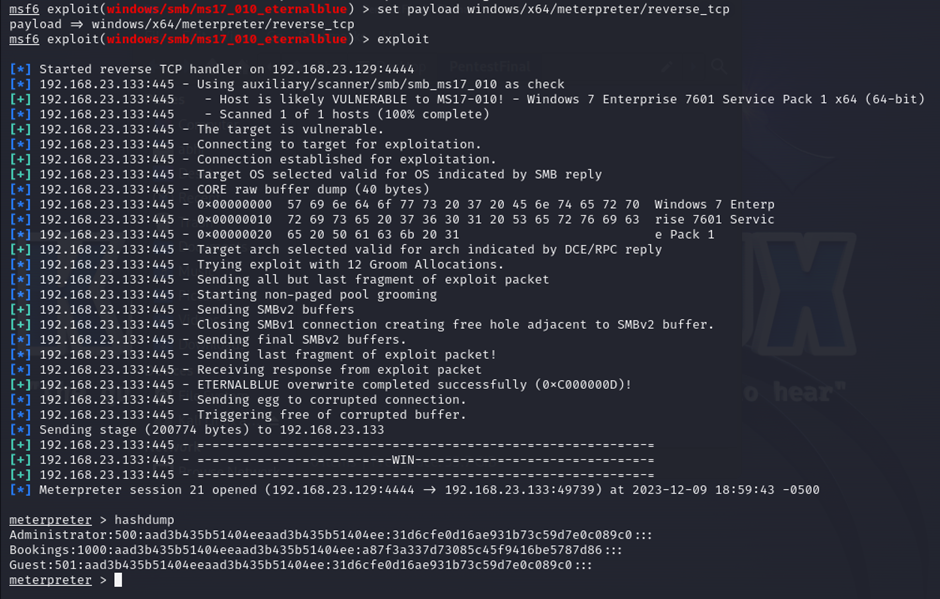

*Figure 6: The testers successfully exploited the vulnerability and
extracted the password hashes on the system*

> Using OCLHashcat, the testers were able to crack the hashes and
> retrieve the password in cleartext.

*Figure 7: The testers ran OCLHashcat against the extracted hashes*

*Figure 8: The testers retrieved the passwords in cleartext*

Using the newly discovered username and password (Bookings/Passw0rd),
the testers were able to use the credentials to log in to the Windows 7
system.

*Figure 9: The testers logged into the Windows 7 system with the
discovered credential*

With the access, the testers identified several shared drives that
contained sensitive information such as Active Directory backups,
password policy, email addresses, and confidential internal notes.

*Figure 10: The list of all computers accessible from the Windows 7
machine*

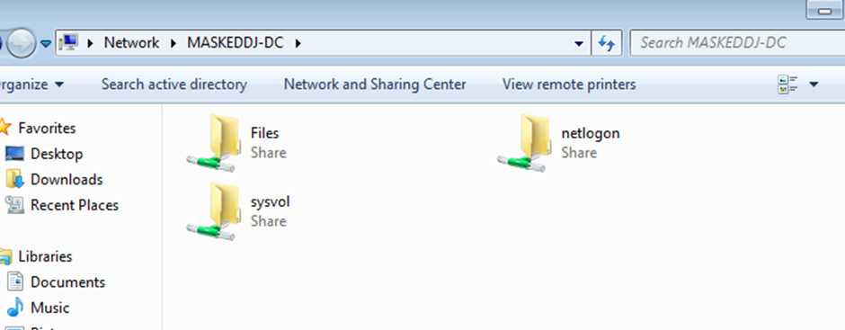

*Figure 11: The list of shared drive on the Windows Server 2016 machine*

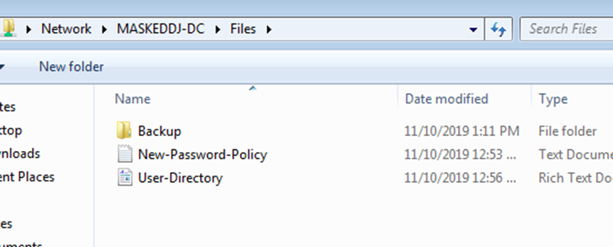

*Figure 12: The testers were able to find the password policy on the
shared drive*

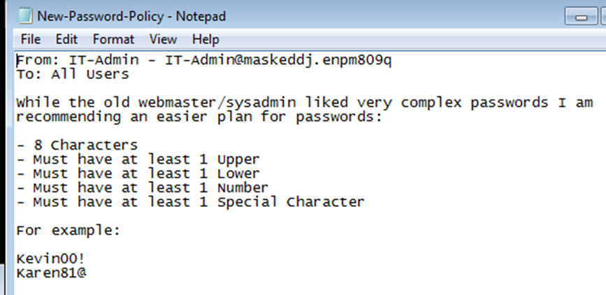

*Figure 13: The password policy found on the shared drive*

*Figure 14: The emails found on the shared drive*

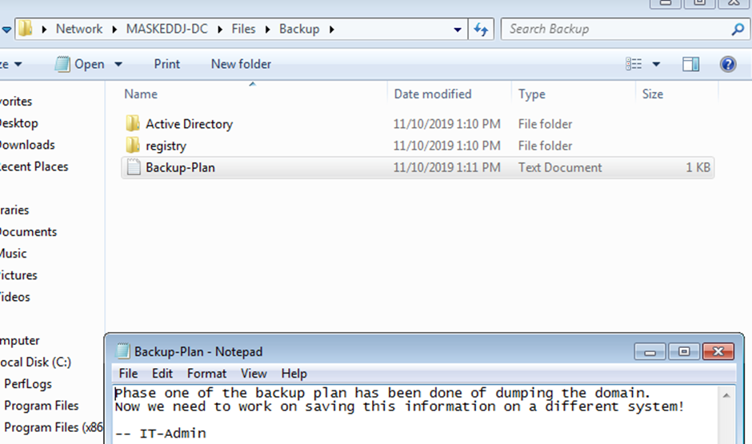
*Figure 15: The confidential internal note found on the shared drive*

*Figure 16: The Active Directory backup found on the shared drive*

*Figure 17: The registry backup found on the shared drive*

Next, the testers exfiltrated the Active Directory and registry backups.
Then, the testers used OCLHash cat to crack the password hashes. Then,
the testers successfully cracked the password hash, revealing the
password for \"Administrator\" and \"IT-Admin\" users.

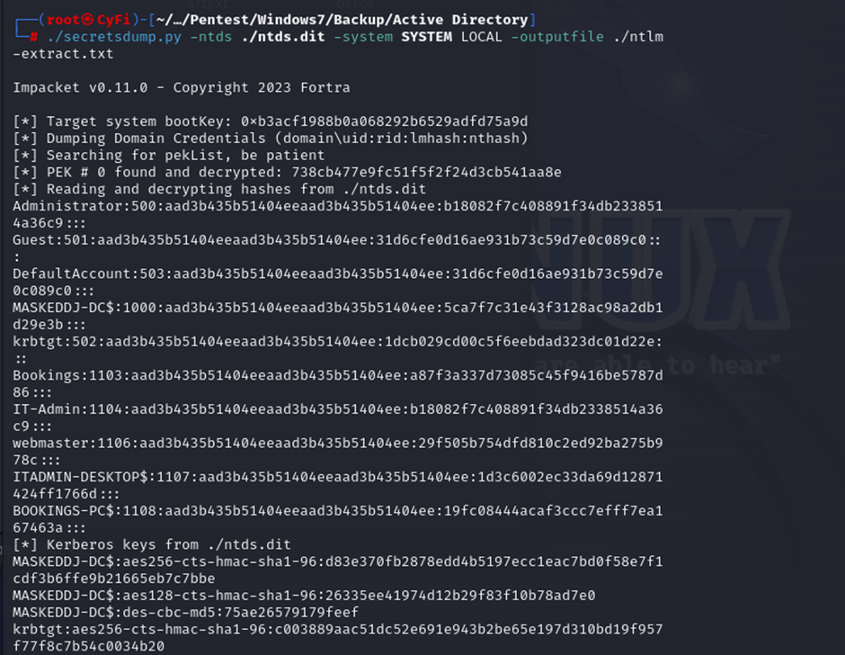{width="6.5in" height="5.027777777777778in"}

*Figure 18: The testers converted the AD backup to NTLM hashes.*

{width="6.5in" height="0.7777777777777778in"}

*Figure 19: OCLHashcat successfully cracked some hashes.*

Using the IT-Admin credential, the testers were able to login to the
Windows Server 2016. Upon logging into the system, the testers discover
a Keepass database file and its password.

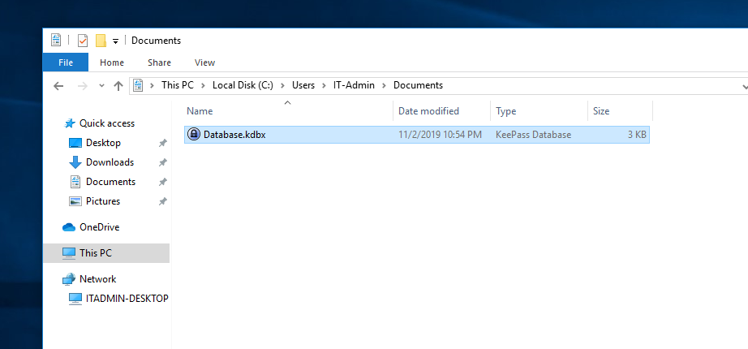{width="6.5in" height="3.0277777777777777in"}

*Figure 20: The Keepass database file found on the Windows Server 2016
machine.*

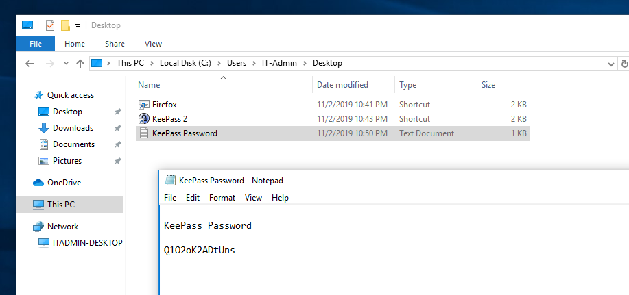{width="6.5in" height="3.0555555555555554in"}

*Figure 21: The password to the Keepass database file found on the
Windows Server 2016 machine.*

The testers were able to open the Keepass database file and capture the
credentials to log in to the Ubuntu system by utilizing the unprotected
password found within the system.

{width="6.5in" height="3.2777777777777777in"}

*Figure 22: The testers were able to view the contents of the Keepass
database file.*

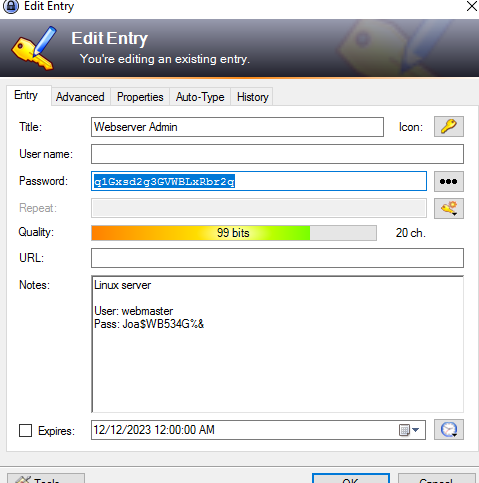{width="4.989583333333333in" height="5.03125in"}

*Figure 23: The credential for logging into the Ubuntu system found in
the Keepass database file.*

Using the credential, the testers were able to login to the Ubuntu
machine.

{width="6.5in" height="2.1527777777777777in"}

*Figure 24: The testers logged into the Ubuntu system.*

The testers discovered that The Masked DJ's identity was uploaded to an
AWS S3 bucket. The testers also found the token to access that S3
bucket.

{width="6.5in" height="0.9444444444444444in"}

*Figure 25: The internal note found on the Ubuntu server.*

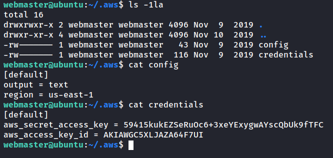{width="6.5in" height="3.0833333333333335in"}

*Figure 26: The AWS access token discovered on the Ubuntu system.*

Using the discovered information, the testers were able to find and
exfiltrate all the flags.

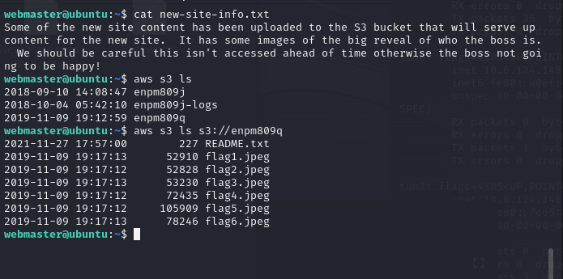{width="6.5in" height="3.2222222222222223in"}

*Figure 27: The testers found all the flags in the AWS S3 bucket.*

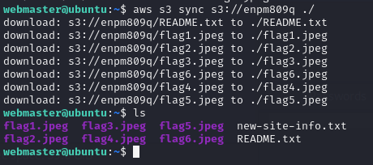{width="4.791666666666667in" height="2.125in"}

*Figure 28: The testers downloaded all the flags.*

The testers were able to reveal the true identity of The Masked DJ.

{width="6.5in" height="1.5694444444444444in"}

*Figure 29: The Masked DJ's true identity.*

The testers were able to view all the flags.

{width="5.770833333333333in" height="7.46875in"}

*Figure 30: All 6 flags.*
